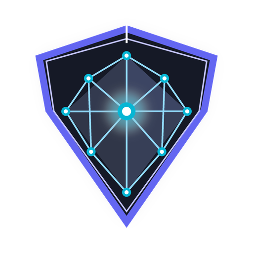
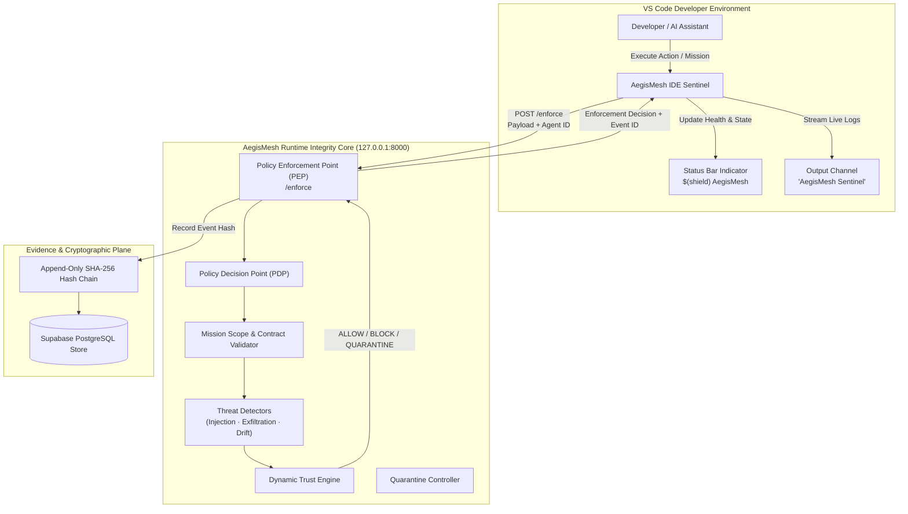

<p align="center">
  
</p>

<h1 align="center">AegisMesh IDE Sentinel</h1>

<p align="center">
  <strong>Zero-trust runtime policy enforcement and cryptographic integrity for AI agents in VS Code.</strong>
</p>

<p align="center">
  <a href="https://github.com/shrivastavanant402-maker/Sentinal/releases"></a>
  <a href="https://github.com/shrivastavanant402-maker/Sentinal/blob/main/LICENSE"></a>
  <a href="https://code.visualstudio.com/"></a>
  <a href="https://github.com/shrivastavanant402-maker/Sentinal"></a>
</p>

---

## 🛡️ What is AegisMesh IDE Sentinel?

When autonomous AI coding agents, copilot extensions, and multi-agent frameworks execute commands in your development workspace, traditional firewalls cannot protect you. Rogue commands, prompt injections in web documentation, and unauthorized file access happen **inside the agent's reasoning loop**.

**AegisMesh IDE Sentinel** embeds an active **Policy Enforcement Point (PEP)** directly into Visual Studio Code. It intercepts agent actions before execution, validates them against declared mission contracts, tracks data taint, detects prompt injections, and logs tamper-evident cryptographic evidence into an append-only SHA-256 ledger.

---

## ✨ Key Capabilities

| Feature | Description |
| :--- | :--- |
| **🛡️ Zero-Trust Interception** | Intercepts agent tool calls (`shell.exec`, `file.read`, `web.search`, etc.) before execution and evaluates them against active mission policies. |
| **🚨 Multi-State Decisions** | Authoritative policy verdicts: **`ALLOW`** (proceed), **`BLOCK`** (reject violation), **`APPROVAL`** (require human elevation), and **`QUARANTINE`** (isolate rogue agent). |
| **📊 Real-Time Status Bar** | Continuous background health and reachability monitoring of the AegisMesh Runtime Core with latency telemetry. |
| **🎯 Multi-Agent Mission Dispatch** | Trigger and observe coordinated multi-agent goals directly from VS Code with live execution streaming in the Output Channel. |
| **⛓️ Cryptographic Audit Linking** | Every enforcement verdict is tied to an immutable SHA-256 ledger event hash for end-to-end non-repudiation. |
| **⚙️ Dynamic Configuration** | Instantly adjust Core backend endpoints and agent identity settings with zero extension restarts. |

---

## 🏛️ Architecture



### How the Security Loop Works:
1. **Interception:** When an action is dispatched, Sentinel sends the candidate action, parameters, and agent identity to the AegisMesh PEP.
2. **Evaluation:** The PEP queries the PDP to check mission contracts, scan for semantic prompt injections, analyze data provenance, and verify agent trust tiers.
3. **Verdict:** The Core returns a definitive verdict (`ALLOW`, `BLOCK`, `APPROVAL`, or `QUARANTINE`).
4. **Audit Sealing:** The transaction is signed and permanently hashed into the cryptographic audit chain.

---

## 🚀 Getting Started

### 1. Installation

#### From VSIX (Local Package)
```bash
code --install-extension vscode-extension/aegismesh-vscode-0.1.0.vsix
```

#### From VS Code Marketplace
Search for **`AegisMesh IDE Sentinel`** in the Extensions sidebar (`Ctrl+Shift+X` / `Cmd+Shift+X`) and click **Install**.

---

### 2. Quick Setup Workflow

1. **Launch AegisMesh Core:** Ensure the AegisMesh backend runtime is active:
   ```bash
   python -m uvicorn backend.app.main:app --host 127.0.0.1 --port 8000
   ```
2. **Observe Status Bar:** When you open VS Code, the bottom status bar will display:
   ```
   $(shield) AegisMesh: Connected
   ```
3. **Verify Health:** Click on the status bar icon or run `AegisMesh: Show Status` from the Command Palette (`Ctrl+Shift+P` / `Cmd+Shift+P`).

---

## ⌨️ Contributed Commands

Access all commands via the Command Palette (`Ctrl+Shift+P` or `Cmd+Shift+P`) by typing `AegisMesh`:

| Command | Identifier | Description |
| :--- | :--- | :--- |
| **AegisMesh: Show Status** | `aegismesh.showStatus` | Displays the current connection state, Core URL, and active Agent ID with quick action shortcuts. |
| **AegisMesh: Check Connection** | `aegismesh.checkConnection` | Actively pings the backend `/health` endpoint and updates the status bar with network latency. |
| **AegisMesh: Test Action** | `aegismesh.testAction` | Interactively submits a candidate tool action (`shell.exec`, etc.) to the PEP and evaluates live enforcement. |
| **AegisMesh: Run Mission** | `aegismesh.runMission` | Dispatches an objective goal to the multi-agent network and streams real-time execution telemetry to the output channel. |

---

## ⚙️ Configuration Settings

Configure Sentinel through the VS Code Settings UI (`Ctrl+,` / `Cmd+,` &rarr; search `AegisMesh`) or in your `.vscode/settings.json`:

| Setting | Type | Default | Description |
| :--- | :--- | :--- | :--- |
| `aegismesh.backendUrl` | `string` | `"http://127.0.0.1:8000"` | Base URL of the AegisMesh Runtime Integrity Core API. |
| `aegismesh.agentId` | `string` | `"ide-agent-01"` | Agent identifier used for IDE action enforcement and cryptographic audit tracking. |

```json
{
  "aegismesh.backendUrl": "http://127.0.0.1:8000",
  "aegismesh.agentId": "ide-agent-01"
}
```

---

## 🔐 Security Model & Guarantees

* **Zero-Trust Default:** No agent action is assumed benign. Every tool invocation requires an explicit contract-allow evaluation.
* **Autonomous Quarantine:** If an agent attempts severe privilege escalation (e.g. out-of-scope shell commands or sensitive credential access), AegisMesh immediately quarantines the agent, revokes its capability token, and isolates it from the network.
* **Cryptographic Non-Repudiation:** Every action generates an immutable SHA-256 event hash linked to its predecessor:
  $$\text{event\_hash} = \text{SHA-256}(\text{previous\_hash} + \text{payload\_content})$$
* **Fail-Closed Resilience:** If the Core backend is unreachable or returns an error, the extension alerts the developer immediately rather than allowing silent un-monitored execution.

---

## 🔧 Troubleshooting

| Symptom | Cause | Solution |
| :--- | :--- | :--- |
| **Status bar shows `Disconnected`** | AegisMesh Core backend is not running or blocked by firewall. | Start the backend on `http://127.0.0.1:8000` and run `AegisMesh: Check Connection`. |
| **`[WinError 10013]` or Port Conflict** | Port 8000 is occupied by an existing process. | Check active ports with `netstat -ano \| findstr :8000` or configure an alternate port in `aegismesh.backendUrl`. |
| **Action returns `QUARANTINE`** | The active agent attempted an unauthorized high-risk action or mission violation. | Inspect the event in the AegisMesh SOC Dashboard (`http://localhost:5173`) and release or re-initialize the agent state. |
| **Mission dispatch fails** | Mission objective string was empty or backend database is unreachable. | Ensure Supabase connectivity is active (`GET /health`) and provide a descriptive mission goal. |

---

## 🗺️ Roadmap

- [x] VS Code status bar indicator with real-time health polling
- [x] Interactive tool action testing via `/enforce`
- [x] Multi-agent mission orchestration dispatch and log streaming
- [x] Modal inspection for `ALLOW`, `BLOCK`, `APPROVAL`, and `QUARANTINE` verdicts
- [x] Cryptographic event hash association
- [ ] Dedicated Activity Bar sidebar panel with live agent fleet cards
- [ ] In-editor inline diagnostics for unsafe prompt strings and exfiltration patterns
- [ ] Direct one-click quarantine release approval flow

---

## 📄 License & Attribution

Distributed under the **Apache-2.0 License**. See [LICENSE](https://github.com/shrivastavanant402-maker/Sentinal/blob/main/LICENSE) for details.

Developed as part of the **AegisMesh Autonomous AI Agent Runtime Integrity Mesh**.
